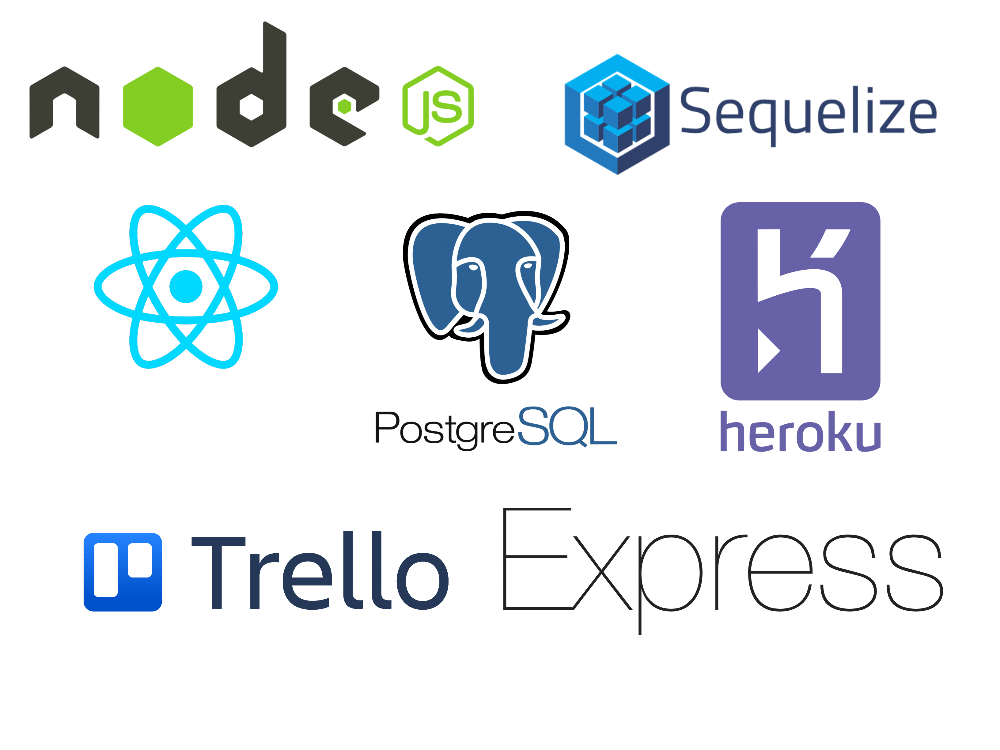
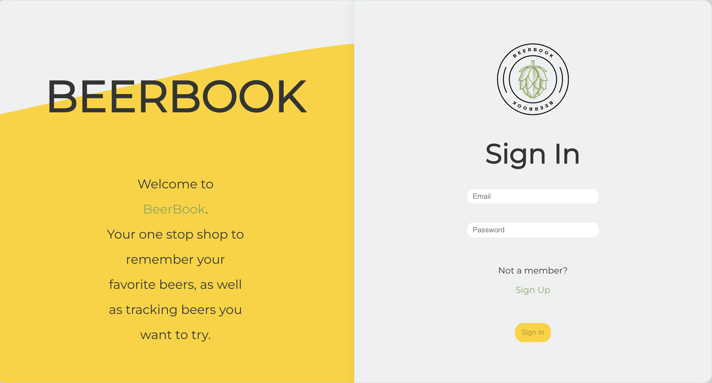

  

# 
 Welcome To BeerBook 

### 
 Your one stop shop for saving your favorite beers, and tracking beers you want to try. 

#

### Date: 11/18/2022

#### By: &nbsp; &nbsp; &nbsp; &nbsp; &nbsp;Derek Lewis | [LinkedIn](http://www.linkedin.com/in/derek-r-lewis) | [GitHub](https://github.com/d-lewis9442)

#### &nbsp; &nbsp; &nbsp; &nbsp; &nbsp; &nbsp; &nbsp; &nbsp;Max Calabro | [LinkedIn](https://www.linkedin.com/in/max-calabro) | [GitHub](https://github.com/max-calabro)

#### &nbsp; &nbsp; &nbsp; &nbsp; &nbsp; &nbsp;Aaron Sanchez | [LinkedIn](https://www.linkedin.com/in/aaron-g-sanchez) | [GitHub](https://github.com/Aaron-G-Sanchez)

&nbsp;

---

### **_Description_**

#### BeerBook is a full-stack PERN application that allows users to create curated lists of beers. Ever seen a beer you want to try later? Make a beer wishlist. Try a delicious brew you want to remember? Toss that beer into your favorites list!

---

### 
**_Technologies Used_**

---

### **_Getting Started_**

#### - Take a look around the existing beer lists.

#### - Create your own list of most and least guzzleable beers.

#### - Add in new local brews.

#### The project itself was deployed with Heroku.

---

## 

### **_Future Updates_**

- [x] Deploy project
- [ ] Add user follower functionallity
- [ ] Responzive design to work for any screen

---

### **_Credits_**

##### General Assembly: [Choose Your Path](https://generalassemb.ly/)

---
